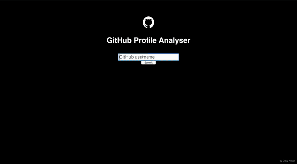

Repository for my individual Software Engineering Project in year 3 of college.


<br/>
My application takes the username entered in the search box and queries the github API to find the profile of the user. It then uses the gathered data to display on the application page. Using chartjs2, I have created 2 graphs:
1. A doughnut graph of all of the user's repositories and their sizes. The chart shows the percentage make-up of each repository.
2. A bar chart of all the languages that the user has utilised in their repositories. 

## Running the application
1. Clone the Repo.
2. Open src/App.jsx and enter your github access token into:
 ```
    const token = "";
 ```
3. Save file and enter:
```
npm start
```
into the workplace terminal.
